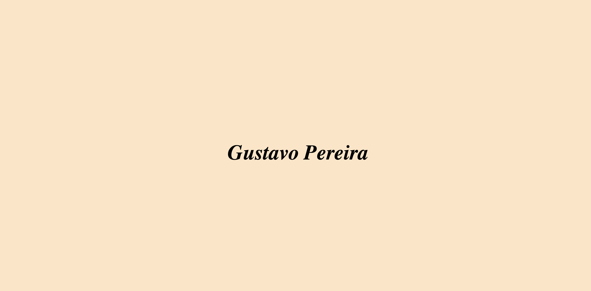

# portifolio

## Projeto
Minha primeira página web, criada durante a disciplina de Linguagem de Marcação do curso de Desenvolvimento de sistemas no Senai Jandira

## Tecnologias
* HTML
* CSS
* GIT
* MARKDOWN

## Autor
[Gustavo Pereira](https://www.linkedin.com/in/gustavo-pereira-04a6502b3?lipi=urn%3Ali%3Apage%3Ad_flagship3_profile_view_base_contact_details%3B4St8jGP7SD%2Bp%2FRfCkiaOPA%3D%3D)